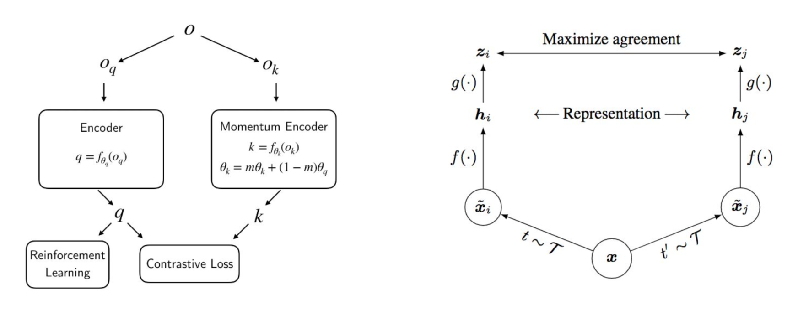

# Contrastive learning in Pytorch, made simple

[](https://badge.fury.io/py/contrastive-learner)

It seems we have lift-off for self-supervised learning on images.

This is a simple to use Pytorch wrapper to enable contrastive self-supervised learning on any visual neural network. At the moment, it contains enough settings for one to train on either of the schemes used in SimCLR or CURL.

You can wrap any neural network that accepts a visual input, be it a resnet, policy network, or the discriminator of a GAN. The rest is taken care of.

## Install

```bash
$ pip install contrastive-learner
```

## Usage

SimCLR (projection head with normalized temperature-scaled cross-entropy loss)

```python
import torch
from contrastive_learner import ContrastiveLearner
from torchvision import models

resnet = models.resnet50(pretrained=True)

learner = ContrastiveLearner(
    resnet,
    image_size = 256,
    hidden_layer = 'avgpool',  # layer name where output is hidden dimension. this can also be an integer specifying the index of the child
    project_hidden = True,     # use projection head
    project_dim = 128,         # projection head dimensions, 128 from paper
    use_nt_xent_loss = True,   # the above mentioned loss, abbreviated
    temperature = 0.1,         # temperature
    augment_both = True        # augment both query and key
)

opt = torch.optim.Adam(learner.parameters(), lr=3e-4)

def sample_batch_images():
    return torch.randn(20, 3, 256, 256)

for _ in range(100):
    images = sample_batch_images()
    loss = learner(images)
    opt.zero_grad()
    loss.backward()
    opt.step()

```

CURL (with momentum averaged key encoder)

```python
import torch
from contrastive_learner import ContrastiveLearner
from torchvision import models

resnet = models.resnet50(pretrained=True)

learner = ContrastiveLearner(
    resnet,
    image_size = 256,
    hidden_layer_index = -2,
    use_momentum = True,         # use momentum for key encoder
    momentum_value = 0.999,
    project_hidden = False,      # no projection heads
    use_bilinear = True,         # in paper, logits is bilinear product of query / key
    use_nt_xent_loss = False,    # use regular contrastive loss
    augment_both = False         # in curl, only the key is augmented
)

opt = torch.optim.Adam(learner.parameters(), lr=3e-4)

def sample_batch_images():
    return torch.randn(20, 3, 256, 256)

for _ in range(100):
    images = sample_batch_images()
    loss = learner(images)
    opt.zero_grad()
    loss.backward()
    opt.step()
    learner.update_moving_average() # update moving average of key encoder
```

## Advanced

If you want to accumulate queries and keys to do contrastive loss on a bigger batch, use the `accumulate` keyword on the forward pass.

```python
for _ in range(100):
    for _ in range(5):
        images = sample_batch_images()
        _ = learner(images, accumulate=True)  # accumulate queries and keys
    loss = learner.calculate_loss()           # calculate similarity on all accumulated
    opt.zero_grad()
    loss.backward()
    opt.step()
```

By default, this will use the augmentations recommended in the SimCLR paper, mainly color jitter, gaussian blur, and random resize crop. However, if you would like to specify your own augmentations, you can simply pass in a `augment_fn` in the constructor. Augmentations must work in the tensor space. If you decide to use torchvision augmentations, make sure the function converts first to PIL `.toPILImage()` and then back to tensors `.ToTensor()`

```python
custom_augment_fn = nn.Sequential(
    kornia.augmentations.RandomHorizontalFlip()
)

learner = ContrastiveLearner(
    resnet,
    image_size = 256,
    hidden_layer_index = -2,
    project_hidden = True,
    project_dim = 128,
    use_nt_xent_loss = True,
    augment_fn = custom_augment_fn
)
```

## Citations

```bibtex
@misc{chen2020simple,
    title   = {A Simple Framework for Contrastive Learning of Visual Representations},
    author  = {Ting Chen and Simon Kornblith and Mohammad Norouzi and Geoffrey Hinton},
    year    = {2020}
}
```

```bibtex
@misc{srinivas2020curl,
    title   = {CURL: Contrastive Unsupervised Representations for Reinforcement Learning},
    author  = {Aravind Srinivas and Michael Laskin and Pieter Abbeel},
    year    = {2020}
}
```
